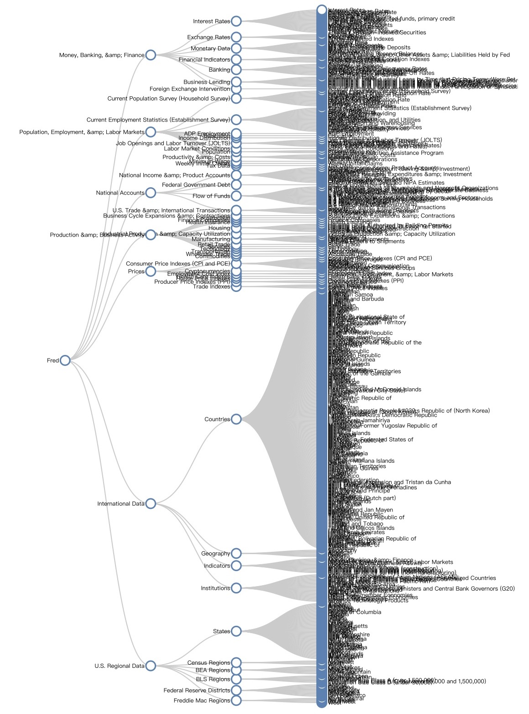

# Crawling Data from FRED

This is a tutorial about how to crawl the FRED big data in a rapid and methodical way

+ A interactive linear tree figure of the category structure of the FRED is in the [webpage](treeLinear.html), with the help of this [blog](http://bl.ocks.org/d3noob/8375092)

+ A round tree figure is in the [webpage](treeRound.html), with the help of the [Observable notebook](https://beta.observablehq.com/@mbostock/d3-radial-tidy-tree)

+ A [jupyter notebook](https://github.com/ydup/crawling-data-from-fred/blob/master/jupyter/CrawlingFRED.ipynb) of the strategy implemention. 

+ Tree of the category [crawler](https://github.com/ydup/crawling-data-from-fred/blob/master/pythonScript/crawlingTree.py) and json file generator
	- [crawlingTree.py](pythonScript/crawlingTree.py)
	- [cateTree.csv](data/cateTree.csv)
	- [jsonFile.json](data/jsonFile.json)

+ Download the top-10 popular data in the single thread way
	- [singleThread.py](pythonScript/singleThread.py)

+ Download the top-10 popular data  in the __multi__ thread way
	- [multiThread.py](pythonScript/multiThread.py)

